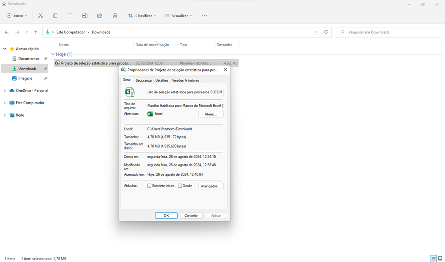

# Projeto de um Sistema de cálculo de amostragem estatística em VBA para abordagens de auditoria
A ferramenta é explicativa e possui alguns informativos afim de que  seja garantido que a sua finalidade seja atingida. Entretanto, antes da tentativa de utrilização desse template é necessário que alguns ajustes no arquivo Excel e no próprio Excel. Sem esses passos os formulários e os módulos não são habilitados. Vamos a eles:

Desbloqueio do arquivo no computador: quando você salvar o arquivo em sua máquina vá até o arquivo no diretório utilizado para que o arquivo fosse salvo (geralmente "downloads"), clique com o botão direito e  clique na caixa de diálogo onde aparece a opção "desbloquear".

Habilitação de macros e controle activex no Excel: abra o Microsoft Excel, clique em "Arquivos", "Opções", "Central de Confiabilidade". Na sessão de Central de Confiabilidade clique em "Configurações do ActiveX" e habilite a opção, conforme tela abaixo:

Clique agora na opção "Configurações de macro": habilite a possibilidade de que macros sejam executadas em sua máquina, conforme tela abaixo:

Pronto! Agora o seu template já está habilitado para funcionar em sua máquina. 
